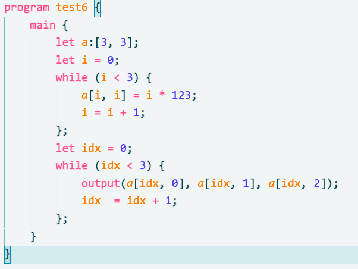

<div align="center">
  
</div>

# L25-Compiler
> Compiler Principle Final Homework with L25 Language.


[](https://deepwiki.com/Voltline/L25-Compiler)

* ✨ L25 Language is founded by ECNU Compiler Principle Course Team. 
* ⚙️ The compiler uses L25 grammar with Flex, Bison and LLVM.
* 🆓 The compiler is open-source based on MIT License.

## 🌟Language Features & Examples
> 🚧 A series of extensions to the original L25 grammar have now been implemented.

### ✨Features
* 🔁 *Nested Functions within Functions(without Closure)*:
```L25
func f1(a) {
    func f2(b) {
        let c = b + 10;
        return c;
    };
    let d = a + f2(a) + 20;
    return d;
}
```
&emsp; 💡 Although nested functions are allowed, inner functions **cannot access symbols in the outer scope**.

* 🧮 *Definition and Invocation of Multidimensional Arrays*:
```L25
... 
main {
    let a: [2, 3, 4];
    let d = a[0, 0, 1] + 10;
}
```

* 🏷️ *Postponed Type Declarations(Type Annotations Placed after Identifiers)*:
```L25
let a: int;
let b: int = 10;
let c = 20;
let d: [3, 4];
```

* 🔚 *Every statement ends with `semicolon`*:
```L25
func f(a, b)
{
    let res;
    if (a > b) {
        res = a;
    } else {
        res = b;
    }; // ⚠️ Remember to add semicolon
    return res;
}
```

* 🧭 *Pointers and address operations*:
```L25
program ptr {
    func inc(p) {
        *p = *p + 1;
        return 0;
    }

    main {
        let x:int = 5;
        let px: *int;
        px = &x;     // take address
        inc(px);     // pass pointer
        output(*px); // dereference
    }
}
```

* 🌊 *32-bit floating point numbers with C-style promotions*:
```L25
program float_ops {
    func sum(a: float, b: float) {
        return a + b;           // returns float, implicitly truncated to int by caller signature
    }

    main {
        let x: float = 1.5;
        let y: float;
        let vec: [2] float;

        y = x + 2;              // int promoted to float
        vec[0] = x;
        vec[1] = y * 2.0;

        output x, y, vec[0], vec[1];
        output sum(y, 0.5), y - 0.5, 3 / 2; // mixed int/float operations
    }
}
```

* 🧱 *Basic Object-Oriented Programming (Class & Method)*:
```L25
program class_method {
    class Counter {
        let val: int;
        func inc(delta) {
            this.val = this.val + delta;
            return this.val;
        }
    }

    main {
        let c: Counter;
        c.val = 5;
        output(c.inc(2), c.val);
    }
}
```

* 🧾 *Procedures without explicit return values*:
```L25
func log_message(msg) {
    output(msg);
    // The function returns 0 implicitly.
}

program demo {
    main {
        log_message(123);
    }
}
```

### 🧪 Examples
* 🌀 Fibonacci Calculate:
```L25
program fibonacci {
    func fibs(n) {
        let tmp:[3];
        tmp[0] = 1;
        tmp[1] = 1;
        let i = 2;
        while (i <= n) {
            tmp[2] = tmp[0] + tmp[1];
            tmp[0] = tmp[1];
            tmp[1] = tmp[2];
            i = i + 1;
        };
        return tmp[2];
    }

    main {
        let n = 0;
        input(n);
        output(fibs(n));
    }
}
```

* 🧊 Multidimensional Array Operations:
```L25
program arr {
    main {
        let a:[3, 3];
        let i = 0;
        while (i < 3) {
            a[i, i] = i * 123;
            i = i + 1;
        };
        let idx = 0;
        while (idx < 3) {
            output(a[idx, 0], a[idx, 1], a[idx, 2]);
            idx  = idx + 1;
        };
    }
}
```

* 🧬 Nested Function Call:
```L25
program nestedFuncCall {
    func f(n) {
        let m = n + 1;
        func f2(m) {
            let x = m + 1;
            return x;
        };
        return m + f2(m);
    }

    main {
        let n = 0;
        input(n);
        output(f(n));
    }
}
```

* 📦 Singly Linked List with Constructors/Destructors:
```L25
program linked_list {
    class Node {
        let value: int;
        let next: *Node;

        Node(v) {
            this.value = v;
            this.next = 0;
        }

        ~Node() {}
    }

    class List {
        let head: *Node;

        List() { this.head = 0; }
        ~List() {
            let cur: *Node; cur = this.head;
            while (cur != 0) {
                let nxt: *Node; nxt = cur.next;
                cur.next = 0; // avoid cascading deletion
                delete cur;
                cur = nxt;
            };
        }

        func push_back(v) {
            let n: *Node;
            n = new Node(v);
            if (this.head == 0) { this.head = n; }
            else {
                let cur: *Node; cur = this.head;
                while (cur.next != 0) { cur = cur.next; };
                cur.next = n;
            };
        }

        func print() {
            let cur: *Node; cur = this.head;
            while (cur != 0) {
                output(cur.value);
                cur = cur.next;
            };
        }
    }

    main {
        let list: *List;
        list = new List();
        list.push_back(1); list.push_back(2); list.push_back(3);
        list.print();
        delete list; // iteratively releases every node
    }
}
```

## 🎨 Visual Studio Code Extensions

> ✨ A syntax highlighting & code snippets extension for VSCode

Though I don't have time to build a full-featured IDE for **L25**, I still made a **lightweight VSCode extension**: [L25-Syntax-Highlight](https://marketplace.visualstudio.com/items?itemName=Voltline.l25-syntax-highlight) 🎉

It provides:
- 🖍️ **Syntax highlighting**
- ✂️ **Code snippets** for faster development

The extension is also open-sourced on GitHub – feel free to check it out and give it a ⭐: [GitHub - L25-Syntax-Highlight](https://github.com/Voltline/L25-Syntax-Highlight) 🚀

👇 Here's what it looks like in action:
<center>

</center>

## 📜 Grammar
> 📐 Extended L25 Grammar with EBNF description
```
<program> =
    "program" <ident> "{"
        { <class_def> | <func_def> }
        "main" "{" <stmt_list> "}"
    "}"

<class_def> =
    "class" <ident> "{"
        { <class_member> }
    "}"

<class_member> =
      <field_decl>
    | <method_def>
    | <ctor_def>

<field_decl> =
    "let" <ident> ":" <type_info> ";"

<method_def> =
    "func" <ident> "(" [ <param_list> ] ")" "{"
        <stmt_list>
        [ "return" <expr> ";" ]
    "}"

<ctor_def> =
    <ident> "(" [ <param_list> ] ")" "{"
        <stmt_list>
    "}"

<func_def> =
    "func" <ident> "(" [ <param_list> ] ")" "{"
        <stmt_list>
        [ "return" <expr> ";" ]
    "}"

<param_list> =
    <typed_ident> { "," <typed_ident> }

<typed_ident> =
    <ident> [ ":" <type_info> ]

<stmt_list> =
    { <stmt> ";" }

<stmt> =
      <declare_stmt>
    | <assign_stmt>
    | <if_stmt>
    | <while_stmt>
    | <input_stmt>
    | <output_stmt>
    | <func_call>
    | <method_call>
    | <nested_func_stmt>

<declare_stmt> =
      "let" <ident>
    | "let" <ident> "=" <expr>
    | "let" <ident> ":" <type_info>
    | "let" <ident> ":" <type_info> "=" <expr>

<assign_stmt> =
    ( <lvalue> ) "=" <expr>

<lvalue> =
      <ident>
    | <array_subscript_expr>
    | <member_access>
    | "*" <factor>

<if_stmt> =
    "if" "(" <bool_expr> ")" "{"
        <stmt_list>
    "}" [ "else" "{"
        <stmt_list>
    "}" ]

<while_stmt> =
    "while" "(" <bool_expr> ")" "{"
        <stmt_list>
    "}"

<input_stmt> =
    "input" "(" <input_arg_list> ")"

<output_stmt> =
    "output" "(" <arg_list> ")"

<nested_func_stmt> =
    <func_def>

<func_call> =
    <ident> "(" [ <arg_list> ] ")"

<method_call> =
    <factor> "." <ident> "(" [ <arg_list> ] ")"

<member_access> =
    <factor> "." <ident>

<arg_list> =
    <expr> { "," <expr> }

<input_arg_list> =
    ( <ident> | <array_subscript_expr> | <member_access> )
    { "," ( <ident> | <array_subscript_expr> | <member_access> ) }

<bool_expr> =
    <expr> ( "==" | "!=" | "<" | "<=" | ">" | ">=" ) <expr>

<expr> =
    [ "+" | "-" ] <term> { ( "+" | "-" ) <term> }

<term> =
    <factor> { ( "*" | "/" | "%" ) <factor> }

<factor> =
      <ident>
    | <number>
    | <float_number>
    | "this"
    | "(" <expr> ")"
    | <func_call>
    | <method_call>
    | <member_access>
    | <array_subscript_expr>
    | "&" <factor>
    | "*" <factor>

<array_subscript_expr> =
    <ident> "[" <array_subscript_list> "]"

<array_subscript_list> =
    <expr> { "," <expr> }

<type_info> =
      <base_type>
    | "[" <dim_list> "]" [ <base_type> ]
    | "*" <type_info>
    | <ident>

<base_type> =
    "int" | "float"

<dim_list> =
    <number> { "," <number> }

<ident> =
    <letter> { <letter> | <digit> }

<number> =
    <digit> { <digit> }

<float_number> =
    <digit> { <digit> } "." <digit> { <digit> }

<letter> =
    "a" | "b" | ... | "z" | "A" | "B" | ... | "Z"

<digit> =
    "0" | "1" | ... | "9"

```

Constructors share the class name and can be defined with any parameter list. The `new ClassName(...)` expression allocates an instance on the heap, resolves a constructor by matching the argument count, and returns a pointer to the class type. Declare the receiving variable accordingly (for example, `let p: *Point = new Point(1, 2);`). If no constructor exists and no arguments are provided, the runtime zero-initializes the allocated storage instead.

Destructors follow the C++-like `~ClassName() { ... }` form (no parameters). Use the `delete <expr>;` statement to destroy a heap object: it first checks for null, invokes the destructor if present, and then releases the memory. Pair every `new` with a corresponding `delete` to avoid leaks because automatic garbage collection is not available yet.

## ⚠️ Notes & Limitations
- `this` can only be used inside class methods.
- Class methods do **not** support overloading.
- All class fields must be declared explicitly using `let`.
- No inheritance or access modifiers (`public` / `private`) are supported.
- Classes are passed by reference-like semantics when used as variables.
- Member access and method calls are left-associative:
  `a.b.c()` is parsed as `(a.b).c()`.
- Class definitions are only allowed at the top level of a program.
- Nested class definitions are not supported.


## 🛠️ Build Instructions
### 🔗 Dependencies
* LLVM (version >= 18)
* Flex (version == 2.6.4)
* Bison (version == 3.8.2)
* Makefile
* Clang (version >= 18.0, with C++20 support)
### ⚙️ Build
* Just use `make` to compile the project, remember to configure your own llvm path in Makefile
```bash
make
./l25cc --help
```

## 🚦 Usage
> 📦 Compile and run `.l25` source files with flexible options.

### 🧾 Basic Usage
```bash
./l25cc <source.l25> [options]
```
### 📑 Options

| 🧩 Option           | 📖 Description                                      |
|------------------|--------------------------------------------------|
| `-emit-ast`      | 🌲 Print the AST (Abstract Syntax Tree)             |
| `-emit-scope`    | 🔍 Print the scope tree after semantic analysis     |
| `-emit-ir`       | ⚙️ Output LLVM IR (`.ll` file)                      |
| `-emit-bc`       | 💾 Output LLVM Bitcode (`.bc` file)                 |
| `-o <file>`      | 📤 Specify the output filename                      |
| `-help`, `--help`| 🆘 Show this help message                           |

### 🤖 Smart Input File Detection

You don't have to specify the source file as the first argument.  
The compiler will **automatically detect the first valid `.l25` file** among the inputs:

```bash
./l25cc -emit-ir test/test1.l25 -o out.ll
./l25cc -o result test/test5.l25 -emit-bc
./l25cc --help
```

### 🧨 Output Behavior

- If `-emit-ir` or `-emit-bc` is specified (or output filename ends with `.ll` / `.bc`), the compiler will **generate LLVM files** accordingly.
- If neither is specified, it will try to **produce an executable** (requires `clang` and `llvm-as` in `PATH`).

## 🗂️ Project Structure
```
L25-Compiler/
├── LICENSE
├── Makefile
├── README.md
├── a.out
├── ast.cpp
├── errorReporter.cpp
├── include
│   ├── ast.h
│   ├── errorReporter.h
│   ├── semanticAnalysis.h
│   └── symbol.h
├── lexer.l
├── main.cpp
├── others
│   ├── banner.png
│   ├── extension-effect.png
│   ├── extension.png
│   ├── logo-light.png
│   └── logo.png
├── parser.y
├── semanticAnalysis.cpp
├── symbol.cpp
├── test
│   ├── error_class_unknown_member.l25
│   ├── error_missing_semicolon.l25
│   ├── error_undeclared_variable.l25
│   ├── error_wrong_call_arity.l25
│   ├── test1.l25
│   ├── test10.l25
│   ├── test11.l25
│   ├── test12.l25
│   ├── test13.l25
│   ├── test14.l25
│   ├── test15.l25
│   ├── test2.l25
│   ├── test3.l25
│   ├── test4.l25
│   ├── test5.l25
│   ├── test6.l25
│   ├── test7.l25
│   ├── test8.l25
│   ├── test9.l25
│   ├── test_class_basic.l25
│   ├── test_class_method_call.l25
│   ├── test_closure.l25
│   ├── test_float.l25
│   └── test_pointer.l25
└── test.sh
```

## 🧠 About LLVM  
<center>

</center>

[LLVM](https://llvm.org/) is a powerful **modular compiler infrastructure** used to build modern language toolchains.  
It provides:
- 🛠️ **Intermediate Representation (IR)** for platform-independent optimizations
- ⚙️ **Backend support** for multiple architectures
- 🔧 Tooling like `clang`, `opt`, and `llc` for code analysis and transformation

L25 leverages LLVM to generate and optimize low-level code efficiently 💡

## 🧑‍💻 Contributions Welcome!
Feel free to submit issues, pull requests, or just give us a ⭐ if you like the project!
Happy coding! 💻✨