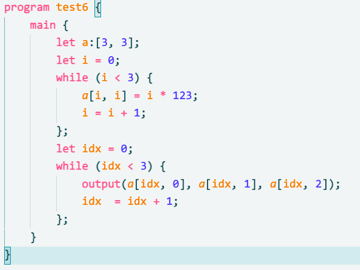

<div align="center">
  
</div>

# L25-Compiler
> Compiler Principle Final Homework with L25 Language.


[](https://deepwiki.com/Voltline/L25-Compiler)

* ✨ L25 Language is founded by ECNU Compiler Principle Course Team. 
* ⚙️ The compiler uses L25 grammar with Flex, Bison and LLVM.
* 🆓 The compiler is open-source based on MIT License.

## 🌟Language Features & Examples
> 🚧 A series of extensions to the original L25 grammar have now been implemented.

### ✨Features
* 🔁 *Nested Functions within Functions*:
```L25
func f1(a) {
    func f2(b) {
        let c = b + 10;
        return c;
    };
    let d = a + f2(a) + 20;
    return d;
}
```

* 🎯 *Typed return values with concise arrow syntax*:
```L25
func add(a: int, b: float) -> float {
    return a + b;
}

func legacy(a) { // no arrow still defaults to int
    return a + 1;
}
```
&emsp; Functions and methods default to returning `int` when the `-> <type>` clause is omitted.

* 🌑 *Explicit null pointers via `nil`*:
```L25
let p: *int = nil;
if (p == nil) {
    output(0);
};
```
&emsp; Literal `0` remains usable as a null pointer, but the compiler will emit a warning recommending `nil` when it is assigned to pointer-typed slots. `null` is also accepted as a synonym for `nil`.

* 🧮 *Definition and Invocation of Multidimensional Arrays*:
```L25
... 
main {
    let a: [2, 3, 4];
    let d = a[0, 0, 1] + 10;
}
```

* 🏷️ *Postponed Type Declarations(Type Annotations Placed after Identifiers)*:
```L25
let a: int;
let b: int = 10;
let c = 20;
let d: [3, 4];
```

* 🔚 *Every statement ends with `semicolon`*:
```L25
func f(a, b)
{
    let res;
    if (a > b) {
        res = a;
    } else {
        res = b;
    }; // ⚠️ Remember to add semicolon
    return res;
}
```

* 🧭 *Pointers and address operations*:
```L25
program ptr {
    func inc(p) {
        *p = *p + 1;
        return 0;
    }

    main {
        let x:int = 5;
        let px: *int;
        px = &x;     // take address
        inc(px);     // pass pointer
        output(*px); // dereference
    }
}
```

* 🌊 *32-bit floating point numbers with C-style promotions*:
```L25
program float_ops {
    func sum(a: float, b: float) {
        return a + b;           // returns float, implicitly truncated to int by caller signature
    }

    main {
        let x: float = 1.5;
        let y: float;
        let vec: [2] float;

        y = x + 2;              // int promoted to float
        vec[0] = x;
        vec[1] = y * 2.0;

        output(x, y, vec[0], vec[1]);
        output(sum(y, 0.5), y - 0.5, 3 / 2); // mixed int/float operations
    }
}
```

* 🧱 *Basic Object-Oriented Programming (Class & Method)*:
```L25
program class_method {
    class Counter {
        let val: int;
        func inc(delta) {
            this.val = this.val + delta;
            return this.val;
        }
    }

    main {
        let c: Counter;
        c.val = 5;
        output(c.inc(2), c.val);
    }
}
```

* 📝 *String literals, concatenation and built-in `strlen`*:
```L25
program string_demo {
    main {
        let hello = "Hello";
        let world = "World";
        let msg = hello + " " + world + "!";
        output(msg);           // Hello World!
        output(strlen(msg));   // 12

        let a: string = "abc";
        let b: string = "abc";
        if (a == b) {
            output(1);         // 1
        };
    }
}
```
&emsp; Strings are represented as `{ i32 len, i8* data }` structs.  Type can be inferred from a string literal or declared explicitly with `string`. Supported operations: concatenation (`+`), comparison (`==`, `!=`), `output`, `input`, and `strlen`.

* 🔍 *Compile-time Reflection for Classes*:
```L25
program reflect {
    class Vec2 {
        let x: int;
        let y: int;
        func length() { return this.x + this.y; }
        func reset()  { this.x = 0; this.y = 0; return 0; }
    }

    main {
        let v: Vec2;
        output(typename(v));        // Vec2
        output(fieldcount(v));      // 2
        output(methodcount(v));     // 2
        output(fieldname(v, 0));    // x
        output(fieldname(v, 1));    // y
        output(methodname(v, 0));   // length
        output(methodname(v, 1));   // reset
    }
}
```
&emsp; Five built-in reflection functions are available: `typename(expr)` returns the type name as a string, `fieldcount(expr)` and `methodcount(expr)` return the number of fields and methods, `fieldname(expr, n)` and `methodname(expr, n)` return the name of the n-th field or method. The index argument can be a runtime expression (e.g., a loop variable) or a compile-time literal.

&emsp; Additionally, `invoke(obj, name_expr [, args...])` enables **runtime method dispatch**&mdash;calling a method by its string name:
```L25
program dynamic_call {
    class Calc {
        let val: int;
        func add(x) { this.val = this.val + x; return this.val; }
        func get() { return this.val; }
    }

    main {
        let c: Calc;
        output(invoke(c, "add", 5));   // 5
        // Loop over all 0-arg methods and call them dynamically:
        let i = 0;
        while (i < methodcount(c)) {
            let name = methodname(c, i);
            output(name);
            i = i + 1;
        };
    }
}
```
&emsp; `invoke` returns `int` (method return values of other types are cast to `int`). It matches candidate methods by argument count and dispatches via `strcmp` at runtime.

* 📦 *Generic Containers — Vector, Map, Deque and Queue*:
```L25
program containers {
    main {
        // vector<int>
        let v: vector<int>;
        v.push(10);
        v.push(20);
        v.push(30);
        output(v.len());       // 3
        output(v[0], v[1]);    // 10 20
        v[1] = 99;
        output(v.get(1));      // 99
        let x: int = v.pop();
        output(x);             // 30

        // map<int, int>
        let m: map<int, int>;
        m.set(1, 100);
        m[2] = 200;
        output(m.get(1));      // 100
        output(m[2]);          // 200
        output(m.contains(1)); // 1
        m.erase(1);
        output(m.len());       // 1

        // deque<int>
        let d: deque<int>;
        d.push_back(10);
        d.push_back(20);
        d.push_front(5);
        output(d.len());       // 3
        output(d.front());     // 5
        output(d.back());      // 20
        output(d[1]);          // 10
        d[1] = 99;
        let f: int = d.pop_front();
        output(f);             // 5
        let b: int = d.pop_back();
        output(b);             // 20

        // queue<int>
        let q: queue<int>;
        q.push(10);
        q.push(20);
        q.push(30);
        output(q.len());       // 3
        output(q.front());     // 10
        output(q.back());      // 30
        let v1: int = q.pop();
        output(v1);            // 10
        output(q.len());       // 2
    }
}
```
&emsp; Vectors support `push`, `pop`, `get`, `set`, `len`, and bracket subscript (`v[i]` / `v[i] = val`).  Maps support `set`, `get`, `contains`, `erase`, `len`, and bracket subscript (`m[k]` / `m[k] = val`).  Deques (double-ended queues) support `push_front`, `push_back`, `pop_front`, `pop_back`, `front`, `back`, `get`, `set`, `len`, and bracket subscript (`d[i]` / `d[i] = val`). Queues (FIFO) support `push`, `pop`, `front`, `back`, and `len`. All four containers are automatically freed when they go out of scope.

* ♻️ *Mark-and-Sweep Garbage Collection*:
```L25
program gc_demo {
    class Node {
        let value: int;
        let next: *Node;
        Node(v: int) { this.value = v; }
    }

    main {
        let a: *Node = new Node(1);
        let b: *Node = new Node(2);
        a.next = b;
        b.next = a; // circular reference — GC handles it
        output(a.value, b.value);

        // deterministic delete is still available
        let c: *Node = new Node(42);
        output(c.value);
        delete c;
    }
}
```
&emsp; All heap objects allocated with `new` (class instances and `new T[n]` arrays) are managed by a **tri-color incremental mark-and-sweep** garbage collector with **Dijkstra-style write barriers**. Local pointer variables, `this`, and pointer function parameters are automatically registered as GC roots. The collector runs incrementally (a few mark/sweep steps per allocation) and adapts its pace to memory pressure&mdash;when usage exceeds 75% of the threshold it accelerates, and when it exceeds 100% it forces a full collection. `delete` remains available for deterministic cleanup: it immediately invokes the destructor, removes the object from the GC list, nullifies dangling root-stack references, and frees the memory. Strings, vectors, and maps continue to use RAII and are not GC-managed.

* 🔀 *Logical operators with short-circuit evaluation*:
```L25
program logic {
    main {
        let a = 1;
        let b = 0;
        if (a > 0 && b == 0) {
            output(1);     // 1 (short-circuits: skips RHS if LHS is false)
        };
        if (a > 0 || b > 0) {
            output(1);     // 1 (short-circuits: skips RHS if LHS is true)
        };
        if (!(a == 0)) {
            output(1);     // 1
        };
    }
}
```
&emsp; `&&` (logical AND), `||` (logical OR) and `!` (logical NOT) are supported in boolean expressions. `&&` and `||` use short-circuit evaluation&mdash;the right-hand side is only evaluated when necessary. Precedence: `!` > `&&` > `||`. Parenthesized sub-expressions are allowed.

* 🔄 *For loops*:
```L25
program for_demo {
    main {
        // with declaration init
        let sum: int = 0;
        for (let i: int = 0; i <= 100; i = i + 1) {
            sum = sum + i;
        };
        output(sum);       // 5050

        // with assignment init
        let j: int;
        for (j = 10; j > 0; j = j - 1) {
            output(j);
        };
    }
}
```
&emsp; `for (init; condition; step) { body }` is supported. The init clause can be either a `let` declaration or an assignment. The condition is a boolean expression, and the step is an assignment statement.

* 🛑 *Break statement for loops*:
```L25
program break_demo {
    main {
        let sum: int = 0;
        let i: int = 0;
        while (i < 100) {
            if (i == 10) {
                break;
            };
            sum = sum + i;
            i = i + 1;
        };
        output(sum);       // 45

        let sum2: int = 0;
        for (let j = 0; j < 100; j = j + 1) {
            if (j == 5) {
                break;
            };
            sum2 = sum2 + j;
        };
        output(sum2);      // 10
    }
}
```
&emsp; `break;` exits the innermost enclosing `while` or `for` loop. RAII cleanup is emitted before the jump. The compiler rejects `break` outside of loops at semantic-analysis time.

* 🚀 *Goroutine-like Concurrency with `spawn` and `channel<T>`*:
```L25
program concurrency {
    func worker(ch: channel<int, 10>, id: int) {
        let i = 0;
        while (i < 5) {
            ch.send(id * 100 + i);
            i = i + 1;
        };
    }

    main {
        let ch: channel<int, 10>;

        for (let i = 0; i < 3; i = i + 1) {
            spawn {
                worker(ch, i);
            };
        };

        let sum: int = 0;
        for (let i = 0; i < 15; i = i + 1) {
            sum = sum + ch.recv();
        };
        output(sum);
    }
}
```
&emsp; `spawn { ... }` launches a block on a thread pool (auto-sized to CPU cores, 2–16 workers). Captured variables are copied by value (strings are deep-copied). `channel<T>` (default capacity 1) or `channel<T, N>` (buffered with capacity N) provides type-safe inter-goroutine communication. Channels support `send(val)`, `recv()`, `len()`, and `close()` methods. The thread pool waits for all spawned tasks before main exits. Channels are automatically freed by RAII.

* 🖨️ *C-style formatted I/O with `printf` and `scanf`*:
```L25
program io_demo {
    main {
        let x: int = 42;
        let y: float = 3.14;
        let s: string = "hello";

        // C-style formatted output
        printf("%d\n", x);
        printf("%f\n", y);
        printf("%s world\n", s);
        printf("x=%d, y=%f, s=%s\n", x, y, s);

        // C-style formatted input — variables are passed directly;
        // the compiler automatically takes their address internally
        let a: int = 0;
        let b: int = 0;
        scanf("%d %d", a, b);
        printf("a=%d, b=%d, sum=%d\n", a, b, a + b);
    }
}
```
&emsp; `printf(fmt, args...)` provides C-style formatted output. L25 `string` values are automatically unwrapped to `char*`, and `float` values are promoted to `double` as required by the C variadic ABI. `scanf(fmt, vars...)` provides C-style formatted input; the first argument is the format string, and subsequent arguments must be variables or array elements (the compiler automatically takes their address). The original `output`/`input` statements are preserved and unaffected.

* 🔬 *GC Monitoring API*:
```L25
program gc_monitor {
    class Node {
        let value: int;
    }

    main {
        output(gc_count());          // number of GC-managed objects
        output(gc_bytes());          // bytes currently tracked by GC
        output(gc_threshold());      // current GC trigger threshold

        let a: *Node = new Node();
        a.value = 1;
        output(gc_count());          // 1

        output(gc_total_allocs());       // total allocations since program start
        output(gc_total_collections());  // total GC cycles run
        output(gc_total_freed());        // total objects freed by GC

        gc_stats();          // print detailed stats to stderr
        gc_pause();          // pause automatic incremental GC
        gc_resume();         // resume automatic incremental GC
        gc_collect();        // manually trigger a full GC cycle
        gc_set_threshold(512); // set GC trigger threshold (bytes)
    }
}
```
&emsp; All GC monitoring functions are registered as built-in functions and can be called like ordinary functions. Query functions (`gc_count`, `gc_bytes`, `gc_threshold`, `gc_total_allocs`, `gc_total_collections`, `gc_total_freed`) return `int`. Action functions (`gc_stats`, `gc_pause`, `gc_resume`, `gc_collect`) and `gc_set_threshold(n)` return `void`. `gc_stats()` writes a detailed statistics report (object count, bytes, threshold, phase, thread count, etc.) to `stderr`.

* 🧾 *Procedures without explicit return values*:
```L25
func log_message(msg) {
    output(msg);
    // The function returns 0 implicitly.
}

program demo {
    main {
        log_message(123);
    }
}
```

* ↩️ *Early return from functions*:
```L25
program early_return {
    func abs(x) {
        if (x < 0) {
            return -x;
        };
        return x;
    }

    func find(arr: [10], target) {
        for (let i = 0; i < 10; i = i + 1) {
            if (arr[i] == target) {
                return i;
            };
        };
        return -1;
    }

    main {
        output(abs(-42));  // 42
        output(abs(7));    // 7
    }
}
```
&emsp; `return <expr>;` can appear anywhere inside a function or method body, including inside `if`/`while`/`for` blocks. RAII cleanup is performed before the return. A bare `return;` (without a value) is also accepted, defaulting to 0.

* 🔢 *Enum types*:
```L25
program enum_demo {
    enum Color {
        Red,
        Green,
        Blue
    }

    main {
        let c = Color.Green;
        output(c);             // 1
        if (c == Color.Red) {
            output(0);
        };
        if (c == Color.Green) {
            output(1);         // 1
        };
    }
}
```
&emsp; Enum values are integer constants starting from 0. Each value is registered globally at compile time and can be used in expressions, comparisons, and assignments.

* � *Module import and standard library namespace*:
```L25
program stdlib_demo {
    import std;

    main {
        std.srand(42);
        let r = std.rand();
        output(r);

        let t1 = std.clock_ms();
        std.sleep_ms(100);
        let t2 = std.clock_ms();
        let elapsed: float = t2 - t1;
        printf("Elapsed: %.1f ms\n", elapsed);
    }
}
```
&emsp; `import std;` enables the standard library functions under the `std` namespace. Available functions: `std.clock_ms()` (returns `float` milliseconds), `std.sleep_ms(ms)`, `std.exit(code)`, `std.rand()` (returns `int`), and `std.srand(seed)`. This prevents naming conflicts between user-defined functions and built-in ones. Without `import std;`, calling `std.xxx()` will produce a semantic error.

* 🔀 *Go-style `select` statement for channel multiplexing*:
```L25
program select_demo {
    main {
        let ch1: channel<int, 4>;
        let ch2: channel<int, 4>;
        ch1.send(42);

        select {
            case v = ch1.recv(): {
                output(v);          // 42
            }
            case w = ch2.recv(): {
                output(w);
            }
            default: {
                output(-1);
            }
        };

        // send case
        let ch3: channel<int, 2>;
        select {
            case ch3.send(100): {
                output(100);        // 100
            }
            default: {
                output(0);
            }
        };
    }
}
```
&emsp; `select { ... }` multiplexes over multiple channel operations, Go-style. Each `case` is either a `recv` (`case val = ch.recv(): { ... }`) or a `send` (`case ch.send(expr): { ... }`). An optional `default` branch runs when no channel operation is immediately ready. Without `default`, the statement spins (with `sched_yield`) until one case succeeds. Only buffered channels support non-blocking `try_send`/`try_recv`; unbuffered channels should be used with a `default` branch to avoid spinning indefinitely.

* 🔤 *String methods*:
```L25
program string_methods {
    main {
        let s = "Hello, World!";

        let sub = s.substr(0, 5);     // "Hello"
        let pos = s.find("World");    // 7
        let ch  = s.char_at(0);       // 72 (ASCII 'H')
        let has = s.contains("World");// 1
        let up  = s.to_upper();       // "HELLO, WORLD!"
        let lo  = s.to_lower();       // "hello, world!"
        let r   = s.replace("World", "L25");  // "Hello, L25!"

        printf("%s %d %d %d\n", sub, pos, ch, has);
        printf("%s\n%s\n%s\n", up, lo, r);
    }
}
```
&emsp; Strings support the following methods: `substr(pos, len)` extracts a substring (returns a new string); `find(target)` returns the index of the first occurrence of a substring (-1 if not found); `char_at(index)` returns the ASCII value of the character at the given index; `contains(target)` returns 1 if the string contains the substring, 0 otherwise; `to_upper()` and `to_lower()` return case-converted copies; `replace(old, new)` replaces the first occurrence of `old` with `new` (returns a new string). All methods that return strings allocate new buffers via `malloc`. The existing `strlen(s)` built-in function continues to work alongside these methods.

### 🧪 Examples
* 🌀 Fibonacci Calculate:
```L25
program fibonacci {
    func fibs(n) {
        let tmp:[3];
        tmp[0] = 1;
        tmp[1] = 1;
        let i = 2;
        while (i <= n) {
            tmp[2] = tmp[0] + tmp[1];
            tmp[0] = tmp[1];
            tmp[1] = tmp[2];
            i = i + 1;
        };
        return tmp[2];
    }

    main {
        let n = 0;
        input(n);
        output(fibs(n));
    }
}
```

* 🧊 Multidimensional Array Operations:
```L25
program arr {
    main {
        let a:[3, 3];
        let i = 0;
        while (i < 3) {
            a[i, i] = i * 123;
            i = i + 1;
        };
        let idx = 0;
        while (idx < 3) {
            output(a[idx, 0], a[idx, 1], a[idx, 2]);
            idx  = idx + 1;
        };
    }
}
```

* 🧬 Nested Function Call:
```L25
program nestedFuncCall {
    func f(n) {
        let m = n + 1;
        func f2(m) {
            let x = m + 1;
            return x;
        };
        return m + f2(m);
    }

    main {
        let n = 0;
        input(n);
        output(f(n));
    }
}
```

* 📦 Singly Linked List with Constructors/Destructors:
```L25
program linked_list {
    class Node {
        let value: int;
        let next: *Node;

        Node(v) {
            this.value = v;
            this.next = nil;
        }

        ~Node() {}
    }

    class List {
        let head: *Node;

        List() { this.head = nil; }
        ~List() {
            let cur: *Node = this.head;
            while (cur != nil) {
                let nxt: *Node = cur.next;
                cur.next = nil;
                cur = nxt;
            };
        }

        func push_back(v) {
            let n: *Node = new Node(v);
            if (this.head == nil) { this.head = n; }
            else {
                let cur: *Node = this.head;
                while (cur.next != nil) { cur = cur.next; };
                cur.next = n;
            };
        }

        func print() {
            let cur: *Node = this.head;
            while (cur != nil) {
                output(cur.value);
                cur = cur.next;
            };
        }
    }

    main {
        let list: *List = new List();
        let tmp: int;
        tmp = list.push_back(1);
        tmp = list.push_back(2);
        tmp = list.push_back(3);
        tmp = list.print();
        delete list;
    }
}
```

## 🎨 Visual Studio Code Extensions

> ✨ A syntax highlighting & code snippets extension for VSCode

Though I don't have time to build a full-featured IDE for **L25**, I still made a **lightweight VSCode extension**: [L25-Syntax-Highlight](https://marketplace.visualstudio.com/items?itemName=Voltline.l25-syntax-highlight) 🎉

It provides:
- 🖍️ **Syntax highlighting**
- ✂️ **Code snippets** for faster development

The extension is also open-sourced on GitHub – feel free to check it out and give it a ⭐: [GitHub - L25-Syntax-Highlight](https://github.com/Voltline/L25-Syntax-Highlight) 🚀

👇 Here's what it looks like in action:
<center>

</center>

## 📜 Grammar
> 📐 Extended L25 Grammar with EBNF description
```
<program> =
    "program" <ident> "{"
        { <import_decl> }
        { <enum_def> }
        { <class_def> }
        { <func_def> }
        "main" "{" <stmt_list> "}"
    "}"

<import_decl> =
    "import" <ident> ";"

<enum_def> =
    "enum" <ident> "{" <enum_value_list> "}"

<enum_value_list> =
    <ident> { "," <ident> }

<class_def> =
    "class" <ident> [ "extends" <ident> ] "{"
        { <class_member> }
    "}"

<class_member> =
      <field_decl>
    | <method_def>
    | <ctor_def>
    | <dtor_def>

<field_decl> =
    "let" <ident> ":" <type_info> ";"

<method_def> =
    "func" <ident> "(" [ <param_list> ] ")" [ "->" <type_info> ] "{"
        <stmt_list>
        [ "return" <expr> ";" ]
    "}"

<ctor_def> =
    <ident> "(" [ <param_list> ] ")" "{"
        <stmt_list>
    "}"

<dtor_def> =
    "~" <ident> "(" ")" "{"
        <stmt_list>
    "}"

<func_def> =
    "func" <ident> "(" [ <param_list> ] ")" [ "->" <type_info> ] "{"
        <stmt_list>
        [ "return" <expr> ";" ]
    "}"

<param_list> =
    <typed_ident> { "," <typed_ident> }

<typed_ident> =
    <ident> [ ":" <type_info> ]

<stmt_list> =
    { <stmt> ";" }

<stmt> =
      <declare_stmt>
    | <assign_stmt>
    | <if_stmt>
    | <while_stmt>
    | <for_stmt>
    | <input_stmt>
    | <output_stmt>
    | <func_call>
    | <delete_stmt>
    | <invoke_stmt>
    | <nested_func_stmt>
    | <spawn_stmt>
    | <select_stmt>
    | <printf_stmt>
    | <scanf_stmt>
    | "break"
    | "return" [ <expr> ]

<printf_stmt> =
    "printf" "(" <arg_list> ")"

<scanf_stmt> =
    "scanf" "(" <arg_list> ")"
    // Note: semantic analysis enforces that arguments after the format
    // string are lvalues (identifiers or array subscript expressions).

<delete_stmt> =
    "delete" <expr>

<invoke_stmt> =
    "invoke" "(" <expr> "," <expr> [ "," <arg_list> ] ")"

<declare_stmt> =
      "let" <ident>
    | "let" <ident> "=" <expr>
    | "let" <ident> ":" <type_info>
    | "let" <ident> ":" <type_info> "=" <expr>

<assign_stmt> =
    ( <lvalue> ) "=" <expr>

<lvalue> =
      <ident>
    | <array_subscript_expr>
    | <member_access>
    | "*" <factor>

<if_stmt> =
    "if" "(" <bool_expr> ")" "{"
        <stmt_list>
    "}" [ "else" "{"
        <stmt_list>
    "}" ]

<while_stmt> =
    "while" "(" <bool_expr> ")" "{"
        <stmt_list>
    "}"

<input_stmt> =
    "input" "(" <input_arg_list> ")"

<output_stmt> =
    "output" "(" <arg_list> ")"

<nested_func_stmt> =
    <func_def>

<func_call> =
    <ident> "(" [ <arg_list> ] ")"

<method_call> =
    <factor> "." <ident> "(" [ <arg_list> ] ")"

<member_access> =
    <factor> "." <ident>

<arg_list> =
    <expr> { "," <expr> }

<input_arg_list> =
    ( <ident> | <array_subscript_expr> )
    { "," ( <ident> | <array_subscript_expr> ) }

<for_stmt> =
    "for" "(" ( <declare_stmt> | <assign_stmt> ) ";" <bool_expr> ";" <assign_stmt> ")" "{"
        <stmt_list>
    "}"

<bool_expr> =
      <expr> ( "==" | "!=" | "<" | "<=" | ">" | ">=" ) <expr>
    | <bool_expr> "&&" <bool_expr>
    | <bool_expr> "||" <bool_expr>
    | "!" <bool_expr>
    | "(" <bool_expr> ")"

<expr> =
    [ "+" | "-" ] <term> { ( "+" | "-" ) <term> }

<term> =
    <factor> { ( "*" | "/" | "%" ) <factor> }

<factor> =
      <ident>
    | <number>
    | <float_number>
    | <string_literal>
    | "this"
    | "nil"
    | "(" <expr> ")"
    | <func_call>
    | <method_call>
    | <member_access>
    | <array_subscript_expr>
    | "new" <ident> "(" [ <arg_list> ] ")"
    | "new" ( "int" | "float" ) "[" <expr> "]"
    | "strlen" "(" <expr> ")"
    | "typename" "(" <expr> ")"
    | "fieldcount" "(" <expr> ")"
    | "methodcount" "(" <expr> ")"
    | "fieldname" "(" <expr> "," <expr> ")"
    | "methodname" "(" <expr> "," <expr> ")"
    | "invoke" "(" <expr> "," <expr> [ "," <arg_list> ] ")"
    | "&" <factor>
    | "*" <factor>

<string_literal> =
    '"' { <any_char> | <escape_seq> } '"'

<escape_seq> =
    "\\" ( "n" | "t" | "r" | "\\" | '"' | "0" )

<array_subscript_expr> =
    <ident> "[" <array_subscript_list> "]"

<array_subscript_list> =
    <expr> { "," <expr> }

<spawn_stmt> =
    "spawn" "{" <stmt_list> "}"

<select_stmt> =
    "select" "{" <select_case_list> "}"

<select_case_list> =
    <select_case> { <select_case> }

<select_case> =
      "case" <ident> "=" <factor> "." "recv" "(" ")" ":" "{" <stmt_list> "}"
    | "case" <factor> "." "send" "(" <arg_list> ")" ":" "{" <stmt_list> "}"
    | "default" ":" "{" <stmt_list> "}"

<type_info> =
      <base_type>
    | "[" <dim_list> "]" [ <base_type> ]
    | "*" <type_info>
    | "vector" "<" <base_type> ">"
    | "map" "<" <base_type> "," <base_type> ">"
    | "deque" "<" <base_type> ">"
    | "queue" "<" <base_type> ">"
    | "channel" "<" <base_type> [ "," <number> ] ">"

<base_type> =
    "int" | "float" | "string" | <ident>

<dim_list> =
    <number> { "," <number> }

<ident> =
    <letter> { <letter> | <digit> }

<number> =
    <digit> { <digit> }

<float_number> =
    <digit> { <digit> } "." <digit> { <digit> }

<letter> =
    "a" | "b" | ... | "z" | "A" | "B" | ... | "Z" | "_"

<digit> =
    "0" | "1" | ... | "9"

```

Constructors share the class name and can be defined with any parameter list. The `new ClassName(...)` expression allocates an instance on the heap via the GC allocator, resolves a constructor by matching the argument count, and returns a pointer to the class type. Declare the receiving variable accordingly (for example, `let p: *Point = new Point(1, 2);`). If no constructor exists and no arguments are provided, the runtime zero-initializes the allocated storage instead.

Destructors follow the C++-like `~ClassName() { ... }` form (no parameters). Use the `delete <expr>;` statement to deterministically destroy a heap object: it first checks for null, invokes the destructor if present, removes the object from the GC list, and then releases the memory. You may also let the GC reclaim unreachable objects automatically at shutdown or when the allocation threshold is exceeded.

## ⚠️ Notes & Limitations
- `this` can only be used inside class methods, constructors and destructors.
- Class methods do **not** support overloading.
- All class fields must be declared explicitly using `let`.
- The `extends` keyword is parsed but inheritance semantics (field/method resolution from base class) are **not yet implemented**.
- No access modifiers (`public` / `private`) are supported.
- Classes are passed by reference-like semantics when used as variables.
- Member access and method calls are left-associative:
  `a.b.c()` is parsed as `(a.b).c()`.
- Chained pointer member access is supported: `node.next.value` correctly loads intermediate pointers.
- Class definitions are only allowed at the top level of a program.
- Nested class definitions are not supported.
- The GC scans all pointer-typed fields (including `*int`, `*float`, etc.) for reachability; containers (`vector`/`map`) holding class pointers are **not** scanned by the collector.
- Strings, vectors, and maps use scope-based RAII cleanup and are not managed by the GC.
- `delete` immediately frees the target, nullifies the source variable (including `this.field`), and clears any dangling root-stack references to prevent use-after-free during GC scanning.
- `spawn` blocks capture variables by value; GC-managed objects should not be created inside `spawn` blocks.
- The thread pool and all spawned tasks are shut down before RAII cleanup to prevent use-after-free.
- `break` can only be used inside `while` or `for` loops.
- `return` can appear anywhere inside a function/method body; bare `return;` defaults to returning 0.
- Enum values are global constants; duplicate names across enums or with existing symbols will cause a redefinition error.
- Only `import std` is currently supported; other module names are accepted syntactically but have no effect.
- Standard library functions (`clock_ms`, `sleep_ms`, `exit`, `rand`, `srand`) require `import std;` and must be called as `std.xxx()`.


## 🛠️ Build Instructions
### 🔗 Dependencies
* LLVM (version >= 18)
* Flex (version == 2.6.4)
* Bison (version == 3.8.2)
* Makefile
* Clang (version >= 18.0, with C++20 support)
### ⚙️ Build
* Just use `make` to compile the project, remember to configure your own llvm path in Makefile
```bash
make
./l25cc --help
```

## 🚦 Usage
> 📦 Compile and run `.l25` source files with flexible options.

### 🧾 Basic Usage
```bash
./l25cc <source.l25> [options]
```
### 📑 Options

| 🧩 Option           | 📖 Description                                      |
|------------------|--------------------------------------------------|
| `-emit-ast`      | 🌲 Print the AST (Abstract Syntax Tree)             |
| `-emit-scope`    | 🔍 Print the scope tree after semantic analysis     |
| `-emit-ir`       | ⚙️ Output LLVM IR (`.ll` file)                      |
| `-emit-bc`       | 💾 Output LLVM Bitcode (`.bc` file)                 |
| `-o <file>`      | 📤 Specify the output filename                      |
| `-help`, `--help`| 🆘 Show this help message                           |

### 🤖 Smart Input File Detection

You don't have to specify the source file as the first argument.  
The compiler will **automatically detect the first valid source file** among the inputs:

```bash
./l25cc -emit-ir test/test1.l25 -o out.ll
./l25cc -o result test/test5.l25 -emit-bc
./l25cc --help
```

### 🧨 Output Behavior

- If `-emit-ir` or `-emit-bc` is specified (or output filename ends with `.ll` / `.bc`), the compiler will **generate LLVM files** accordingly.
- If neither is specified, it will try to **produce an executable** (requires `clang` and `llvm-as` in `PATH`).

## 🗂️ Project Structure
```
L25-Compiler/
├── AGENTS.md
├── LICENSE
├── Makefile
├── README.md
├── bench
│   └── bench_gc.c
├── include
│   ├── ast.h
│   ├── codegen_utils.h
│   ├── errorReporter.h
│   ├── semanticAnalysis.h
│   └── symbol.h
├── others
│   ├── banner.png
│   ├── extension-effect.png
│   ├── extension.png
│   ├── logo-light.png
│   └── logo.png
├── runtime
│   ├── l25_channel.c
│   ├── l25_clock.c
│   ├── l25_deque.c
│   ├── l25_gc.c
│   ├── l25_gc.h
│   ├── l25_map.c
│   ├── l25_queue.c
│   ├── l25_runtime.h
│   ├── l25_stdlib.c
│   ├── l25_string.c
│   ├── l25_thread.c
│   └── l25_vector.c
├── src
│   ├── ast_class.cpp
│   ├── ast_expr.cpp
│   ├── ast_func.cpp
│   ├── ast_node.cpp
│   ├── ast_reflect.cpp
│   ├── ast_spawn.cpp
│   ├── ast_stmt.cpp
│   ├── ast_string.cpp
│   ├── codegen_utils.cpp
│   ├── errorReporter.cpp
│   ├── lexer.l
│   ├── main.cpp
│   ├── parser.y
│   ├── semanticAnalysis.cpp
│   └── symbol.cpp
├── test
│   ├── bench_parallel.l25
│   ├── error_class_unknown_member.l25
│   ├── error_missing_semicolon.l25
│   ├── error_undeclared_variable.l25
│   ├── error_wrong_call_arity.l25
│   ├── test1.l25 .. test20.l25
│   ├── test_bool.l25
│   ├── test_break.l25
│   ├── test_channel_capacity.l25
│   ├── test_channel_close.l25
│   ├── test_channel_closed.l25
│   ├── test_channel_range.l25
│   ├── test_channel_unbuffered.l25
│   ├── test_class_basic.l25
│   ├── test_class_method_call.l25
│   ├── test_closure.l25
│   ├── test_complex_concurrent.l25
│   ├── test_cpu_occupy.l25
│   ├── test_delete_gc.l25
│   ├── test_delete_safety.l25
│   ├── test_deque.l25
│   ├── test_enum.l25
│   ├── test_float.l25
│   ├── test_for.l25
│   ├── test_gc.l25
│   ├── test_gc_monitor.l25
│   ├── test_gc_spawn.l25
│   ├── test_invoke.l25
│   ├── test_logical.l25
│   ├── test_map.l25
│   ├── test_new_array.l25
│   ├── test_pointer.l25
│   ├── test_printf.l25
│   ├── test_queue.l25
│   ├── test_raii_class.l25
│   ├── test_raii_func.l25
│   ├── test_raii_linked_list.l25
│   ├── test_raii_string.l25
│   ├── test_reflection.l25
│   ├── test_return.l25
│   ├── test_runtime_reflect.l25
│   ├── test_scanf.l25
│   ├── test_spawn.l25
│   ├── test_spawn_fib.l25
│   ├── test_spawn_multi.l25
│   ├── test_stdlib.l25
│   ├── test_string.l25
│   ├── test_vector.l25
│   └── test_vector_class.l25
├── test.sh
└── test_raii.sh
```

## 🧠 About LLVM  
<center>

</center>

[LLVM](https://llvm.org/) is a powerful **modular compiler infrastructure** used to build modern language toolchains.  
It provides:
- 🛠️ **Intermediate Representation (IR)** for platform-independent optimizations
- ⚙️ **Backend support** for multiple architectures
- 🔧 Tooling like `clang`, `opt`, and `llc` for code analysis and transformation

L25 leverages LLVM to generate and optimize low-level code efficiently 💡

## 🧑‍💻 Contributions Welcome!
Feel free to submit issues, pull requests, or just give us a ⭐ if you like the project!
Happy coding! 💻✨